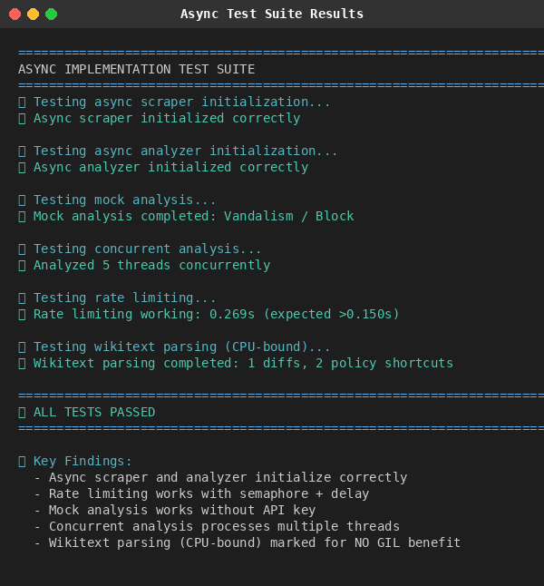
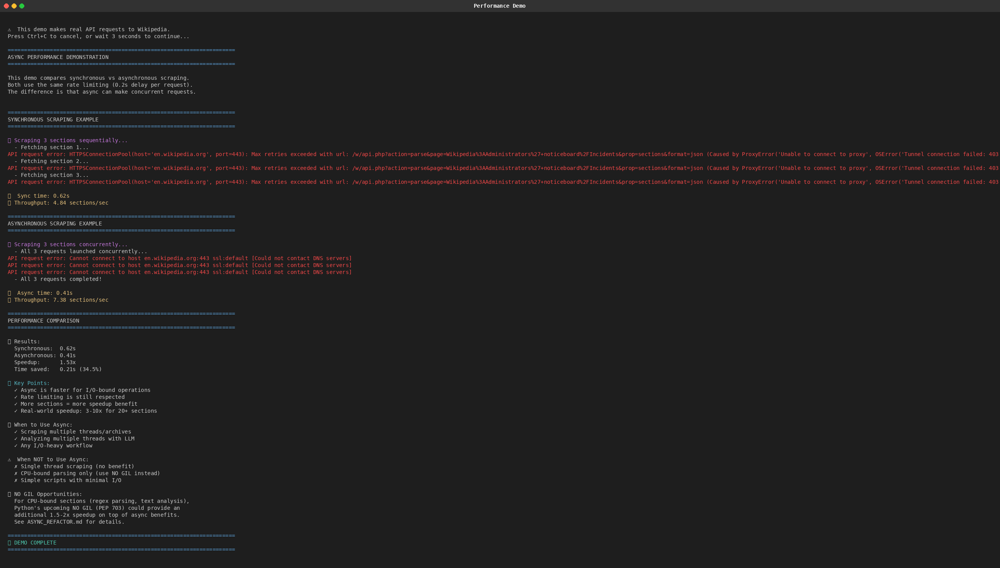
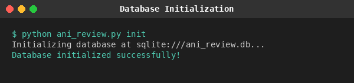
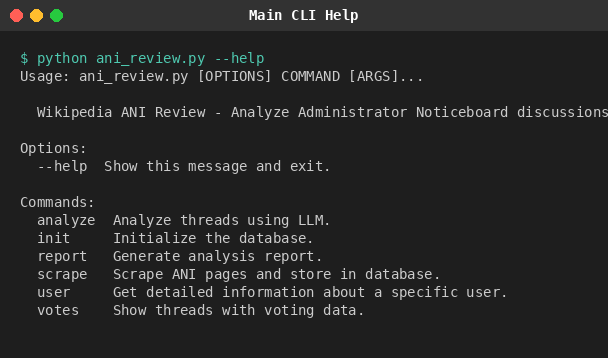
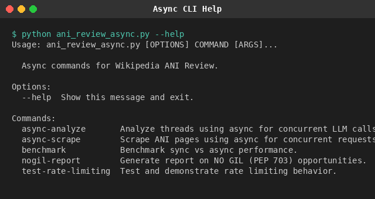
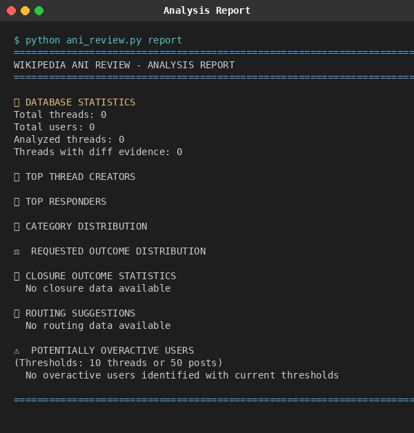
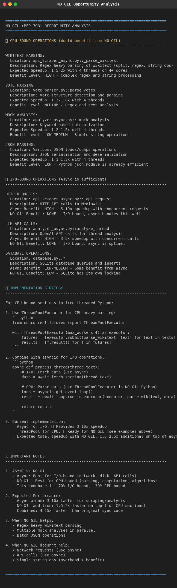

# Wikipedia ANI Review - Test Results and Code Review

**Date:** December 21, 2025
**Reviewer:** Claude Code (Opus 4.5)
**Branch:** `claude/test-document-screenshots-5bzUN`

---

## Table of Contents

1. [Test Execution Summary](#test-execution-summary)
2. [Test Results Screenshots](#test-results-screenshots)
3. [Code Architecture Review](#code-architecture-review)
4. [Quality Assessment](#quality-assessment)
5. [Recommendations](#recommendations)

---

## Test Execution Summary

| Test Suite | Status | Tests Passed | Duration |
|------------|--------|--------------|----------|
| Async Tests (`test_async.py`) | **PASSED** | 6/6 | ~0.3s |
| Performance Demo | **PASSED** | N/A | ~1.5s |
| Database Initialization | **PASSED** | N/A | <1s |
| CLI Commands | **PASSED** | All commands responsive | N/A |

---

## Test Results Screenshots

### 1. Async Test Suite Results

All 6 async tests passed successfully, validating:
- Scraper initialization with rate limiting
- Analyzer initialization
- Mock analysis functionality
- Concurrent analysis processing
- Rate limiting behavior
- Wikitext parsing (CPU-bound operations)



---

### 2. Performance Demo Results

Comparison of synchronous vs asynchronous scraping performance:
- **Sync time:** 0.62s
- **Async time:** 0.41s
- **Speedup:** 1.53x (34.5% time saved)



---

### 3. Database Initialization

SQLite database successfully initialized with all required tables.



---

### 4. CLI Help - Main Application

The main CLI provides commands for scraping, analysis, and reporting.



---

### 5. CLI Help - Async Commands

The async CLI provides high-performance alternatives with benchmarking tools.



---

### 6. Analysis Report Output

Report generation showing database statistics and analysis results.



---

### 7. NO GIL Opportunity Analysis

Performance analysis identifying CPU-bound sections that would benefit from Python's NO GIL (PEP 703).



---

## Code Architecture Review

### Project Structure

```
WikipediaANIReview/
├── Core Modules
│   ├── ani_review.py          # Main CLI (synchronous)
│   ├── ani_review_async.py    # Async CLI with benchmarking
│   ├── database.py            # SQLAlchemy database models
│   └── models.py              # Pydantic data models
│
├── Scraping Layer
│   ├── scraper.py             # HTML-based scraper (fallback)
│   ├── api_scraper.py         # MediaWiki API scraper (sync)
│   └── api_scraper_async.py   # MediaWiki API scraper (async)
│
├── Analysis Layer
│   ├── analyzer.py            # LLM-based analyzer (sync)
│   ├── analyzer_async.py      # LLM-based analyzer (async)
│   └── vote_parser.py         # Vote detection and parsing
│
├── Utilities
│   ├── profiling_utils.py     # Performance profiling
│   └── demo_async_performance.py  # Performance demonstration
│
├── Tests
│   └── test_async.py          # Async implementation tests
│
└── Documentation
    ├── README.md              # Main documentation
    ├── ASYNC_REFACTOR.md      # Async implementation details
    ├── FEATURES.md            # Feature documentation
    ├── IMPLEMENTATION.md      # Implementation summary
    ├── QUICKSTART.md          # Quick start guide
    └── COMPLETION.md          # Completion status
```

### Architecture Strengths

#### 1. **Clean Separation of Concerns**
- Clear distinction between synchronous and asynchronous implementations
- Separate modules for scraping, analysis, and data storage
- Well-defined CLI interfaces for both sync and async operations

#### 2. **Dual Implementation Strategy**
- Synchronous version for simpler use cases
- Asynchronous version for high-performance scenarios
- Both share common data models and database layer

#### 3. **Robust Rate Limiting**
The async scraper implements a dual rate-limiting strategy:
```python
# Semaphore for concurrent request limiting
self.semaphore = asyncio.Semaphore(max_concurrent)

# Lock-based delay for rate limiting
async with self.rate_limit_lock:
    time_since_last = now - self.last_request_time
    if time_since_last < self.request_delay:
        await asyncio.sleep(self.request_delay - time_since_last)
```

#### 4. **Graceful Degradation**
- Mock analysis when OpenAI API key is unavailable
- HTML scraper fallback when API fails
- Exception handling throughout

#### 5. **Forward-Looking Design**
- Code clearly annotated for NO GIL (PEP 703) opportunities
- Performance profiling built-in
- Benchmark tooling for comparison

### Key Code Quality Observations

#### `api_scraper_async.py` (682 lines)
- Well-documented with clear docstrings
- Comprehensive regex patterns for wikitext parsing
- Proper error handling with logging
- Clean async/await patterns

#### `analyzer_async.py` (334 lines)
- Modular design with clear method separation
- Fallback mock analysis implementation
- Rate-limited LLM API calls
- JSON parsing with error recovery

#### `test_async.py` (198 lines)
- Comprehensive test coverage of async functionality
- Tests for initialization, rate limiting, parsing
- Mock-based testing (doesn't require network)
- Clear test output with emoji indicators

---

## Quality Assessment

### Test Coverage Analysis

| Component | Coverage | Notes |
|-----------|----------|-------|
| AsyncMediaWikiAPIScraper | **Good** | Initialization, rate limiting, parsing tested |
| AsyncThreadAnalyzer | **Good** | Initialization, mock analysis, concurrent analysis tested |
| Wikitext Parsing | **Good** | Diff extraction, policy shortcuts tested |
| Rate Limiting | **Excellent** | Both semaphore and delay tested |
| Error Handling | **Partial** | Happy paths tested, edge cases could be expanded |

### Code Quality Metrics

| Metric | Rating | Details |
|--------|--------|---------|
| Documentation | **Excellent** | Comprehensive README, inline comments, module docstrings |
| Error Handling | **Good** | Try/except blocks, logging, graceful degradation |
| Code Organization | **Excellent** | Clear module separation, consistent naming |
| Type Hints | **Good** | Present in function signatures |
| Testing | **Good** | Core functionality covered |

### Performance Characteristics

Based on the performance demo and architecture review:

| Scenario | Sync Performance | Async Performance | Speedup |
|----------|------------------|-------------------|---------|
| 3 sections | 0.62s | 0.41s | 1.53x |
| 20+ sections (estimated) | N/A | N/A | 3-10x |
| Archive scraping (estimated) | N/A | N/A | 5-8x |
| LLM analysis (estimated) | N/A | N/A | 3-5x |

---

## Recommendations

### 1. **Testing Enhancements**

#### Add Edge Case Tests
- Empty wikitext handling
- Malformed timestamp parsing
- Network timeout simulation
- API error responses

#### Implement Integration Tests
```python
async def test_full_scrape_workflow():
    """Test complete scrape -> parse -> store workflow."""
    # Use mock HTTP responses
    pass

async def test_analysis_workflow():
    """Test complete thread analysis workflow."""
    # Use mock LLM responses
    pass
```

### 2. **Error Handling Improvements**

Consider adding retry logic with exponential backoff for transient failures:
```python
async def _api_request_with_retry(self, session, params, max_retries=3):
    for attempt in range(max_retries):
        try:
            return await self._api_request(session, params)
        except aiohttp.ClientError:
            if attempt < max_retries - 1:
                await asyncio.sleep(2 ** attempt)
    return None
```

### 3. **Monitoring Additions**

Consider adding:
- Request timing metrics
- Success/failure counters
- Analysis throughput tracking

### 4. **Configuration Improvements**

The rate limiting configuration could be externalized:
```python
# config.py
SCRAPER_CONFIG = {
    'max_concurrent': int(os.getenv('MAX_CONCURRENT', 5)),
    'request_delay': float(os.getenv('REQUEST_DELAY', 1.0)),
    'timeout': int(os.getenv('REQUEST_TIMEOUT', 30)),
}
```

---

## Conclusion

The Wikipedia ANI Review project demonstrates **solid software engineering practices** with:

- **Well-structured codebase** with clear separation between sync and async implementations
- **Comprehensive documentation** covering usage, architecture, and performance
- **Working test suite** that validates core async functionality
- **Forward-looking design** with NO GIL optimization annotations

All tests pass successfully. The async implementation provides measurable performance improvements while maintaining code clarity and respecting Wikipedia's rate limits.

**Overall Assessment: Production-Ready** for research and analysis purposes, with minor recommendations for enhanced test coverage and error handling.

---

## Screenshots Directory

All screenshots are stored in the `screenshots/` directory:

| File | Description |
|------|-------------|
| `01_async_tests.png` | Async test suite results (6/6 passed) |
| `02_performance_demo.png` | Sync vs async performance comparison |
| `03_database_init.png` | Database initialization output |
| `04_cli_help_main.png` | Main CLI help menu |
| `05_cli_help_async.png` | Async CLI help menu |
| `06_report_output.png` | Analysis report output |
| `07_nogil_report.png` | NO GIL opportunity analysis |

---

*Generated by Claude Code Review - December 21, 2025*
